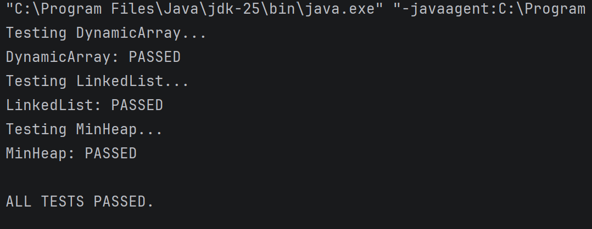
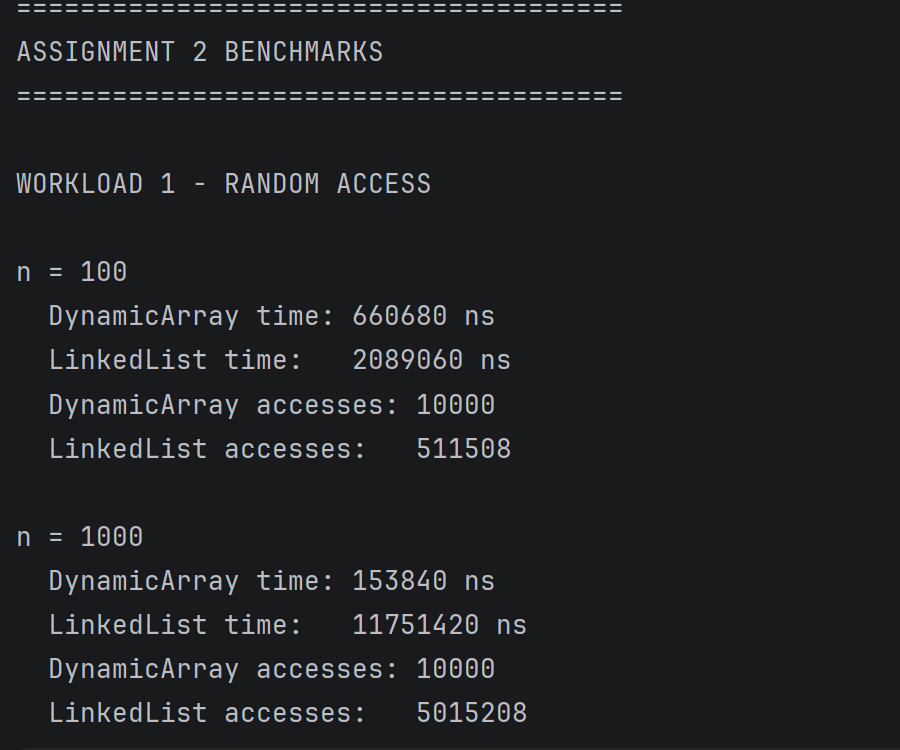
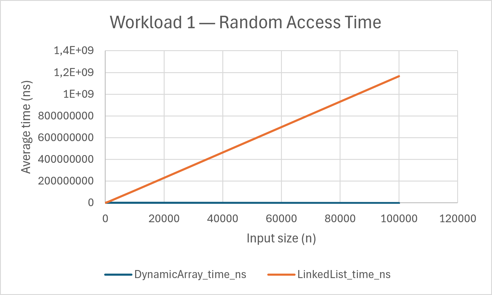
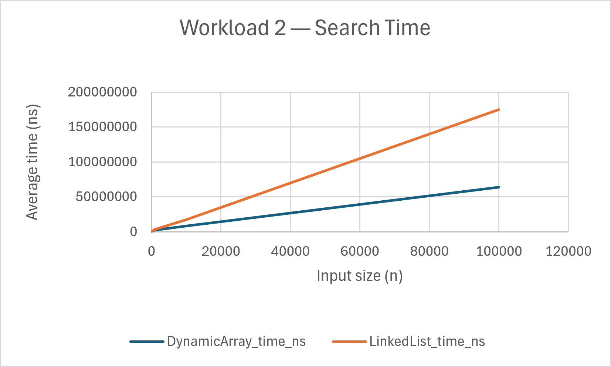
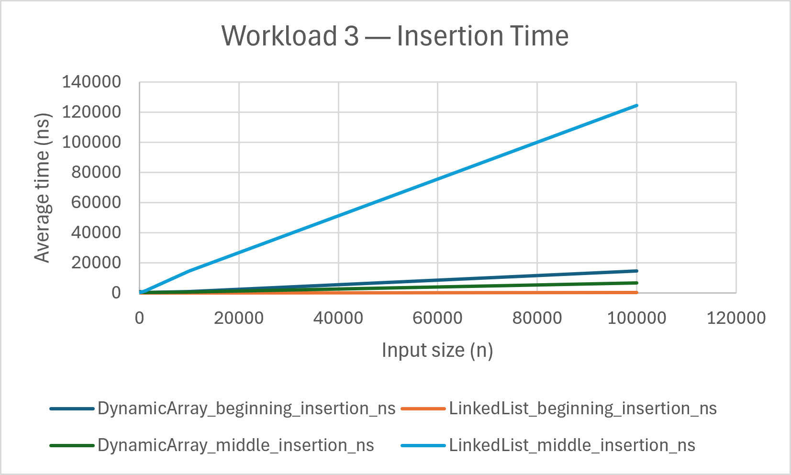
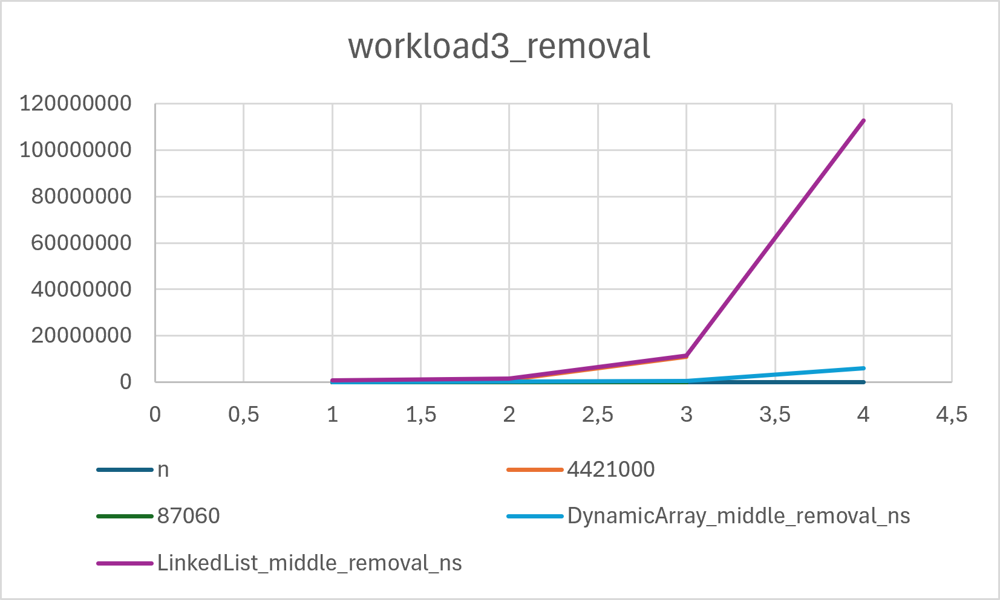
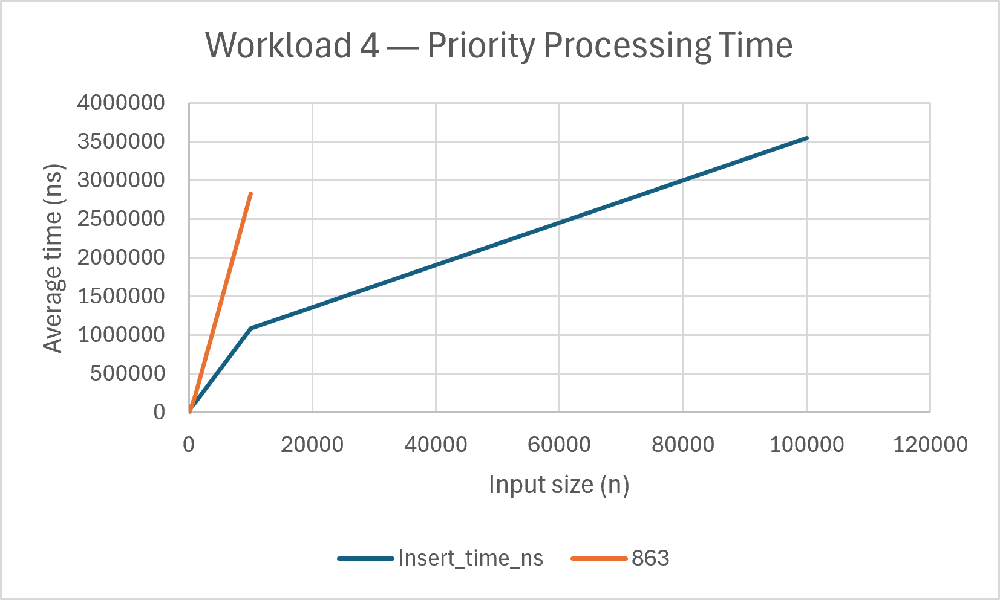

# Assignment 2 - Algorithm Analysis

## Introduction

This assignment implements and compares three data structures:

- DynamicArray
- LinkedList
- MinHeap

The project includes data structure implementations, functional tests, benchmark workloads, result tables, charts, complexity analysis, performance analysis and loop invariant proofs.

The main goal is to compare theoretical algorithmic complexity with measured performance.

## Data Structures

### DynamicArray

DynamicArray stores elements in an integer array.

The implemented operations include:

- add
- add at a specific index
- remove
- get
- contains

The internal array is resized when it becomes full.

DynamicArray provides direct indexed access. Insertions and removals may require shifting elements.

### LinkedList

LinkedList is implemented using nodes.

The implementation keeps references to both the head and tail nodes.

The implemented operations include:

- add
- add at a specific index
- remove
- get
- contains

LinkedList can efficiently add and remove elements at the beginning, but indexed access requires traversing the list.

### MinHeap

MinHeap is implemented using an array and maintains the min-heap property.

The implemented operations include:

- insert
- peekMin
- extractMin

The heap uses `siftUp` after insertion and `siftDown` after extraction.

## Testing

`Tests.java` checks the main functionality of all three data structures.

The tests include:

- empty structures
- single elements
- multiple elements
- duplicate values
- insertion
- removal
- boundary cases
- invalid indexes
- large inputs
- MinHeap ordering

### Test Output

The following screenshot shows the final test execution:



The tests passed successfully:

```text
Testing DynamicArray...
DynamicArray: PASSED
Testing LinkedList...
LinkedList: PASSED
Testing MinHeap...
MinHeap: PASSED

ALL TESTS PASSED.
### Benchmark

Benchmark.java contains four workloads used to compare the performance of the implemented data structures.

The benchmark uses the following input sizes:

100
1,000
10,000
100,000

Execution time is measured using System.nanoTime().

The benchmark also records additional operation metrics such as accesses and comparisons.

### Benchmark Output

The following screenshot shows the benchmark execution output:


### Workload 1 - Random Access


Random indexes are used to compare indexed access between DynamicArray and LinkedList.

The benchmark records:

execution time
number of accesses

DynamicArray provides direct indexed access, while LinkedList must traverse nodes to reach an indexed position.

### Workload 2 - Search

Linear search is performed on DynamicArray and LinkedList.

The benchmark records:

execution time
number of comparisons

Both structures use linear search, so the theoretical search complexity is Θ(n).

### Workload 3 - Insertion and Removal


Insertion and removal are measured at the beginning and in the middle of DynamicArray and LinkedList.

The benchmark records execution time and access metrics.

Beginning operations demonstrate the advantage of LinkedList because elements can be inserted or removed by updating the head.

Middle operations involve different costs. DynamicArray can directly access the required position but may need to shift elements. LinkedList must traverse the list before performing the operation.

Insertion

### Workload 3 - Removal



### Workload 4 - Priority Processing


MinHeap insertion and extraction are measured for different input sizes.

The benchmark records:

insertion time
extraction time
insertion comparisons
extraction comparisons

The results demonstrate the logarithmic behaviour expected from binary heap operations.

### Results and Observations

The benchmark results show the expected differences between the data structures.

DynamicArray performs indexed access directly, while LinkedList must traverse nodes to reach an indexed position. This becomes particularly noticeable as the input size increases.

For beginning insertion and removal, LinkedList can update the head without shifting all existing elements.

For middle operations, DynamicArray can directly access the required position but may need to move elements. LinkedList must traverse the list before performing the operation.

For search, both structures perform linear search and therefore have Θ(n) theoretical complexity.

For MinHeap, insertion and extraction depend on the height of the heap. Since a binary heap has logarithmic height, these operations have Θ(log n) worst-case complexity.

Individual execution times should not be treated as exact proofs of theoretical complexity because JVM optimisation, caching, memory layout, garbage collection and other system effects can affect measurements.

### Result Tables

The benchmark tables are stored in:

results/tables/

The available result files are:

workload1_random_access.csv
workload2_search.csv
workload3_insertion_removal.csv
workload4_priority_processing.csv
Assignment2_Results.xlsx

The CSV files contain the numerical benchmark results for each workload.

The Excel workbook contains the collected benchmark results and can be used for further analysis.

### Complexity Analysis

The theoretical complexity analysis is stored in:

results/tables/complexity_analysis.md

It contains best-case, average-case, worst-case and auxiliary-space complexities for the implemented operations.

The analysis covers:

DynamicArray
LinkedList
MinHeap
### Loop Invariants

The loop invariant proofs are stored in:

results/invariant_proofs.md

The proofs cover:

DynamicArray.contains()
MinHeap.siftDown()

Each proof explains:

initialization
maintenance
termination
why the invariant proves correctness
### Performance Analysis

The comparison between theoretical complexity and measured benchmark results is stored in:

results/tables/performance_analysis.md

The analysis compares the measured performance with the expected theoretical behaviour.

It also discusses:

access counters
comparison counters
scaling behaviour
differences between DynamicArray and LinkedList
MinHeap performance

Measured execution time can be affected by JVM optimisation, caching, memory layout, garbage collection and other system effects.

Therefore, benchmark results are used to examine general performance patterns rather than treating individual nanosecond measurements as exact complexity proofs.

### Project Structure
assignment2-algorithm-analysis/
│
├── README.md
├── pom.xml
│
├── src/
│   ├── main/
│   │   └── java/
│   │       ├── DynamicArray.java
│   │       ├── LinkedList.java
│   │       ├── MinHeap.java
│   │       └── Benchmark.java
│   │
│   └── test/
│       └── java/
│           └── Tests.java
│
└── results/
    ├── plots/
    │   ├── test_output.png
    │   ├── benchmark_output.png
    │   ├── workload1_random_access.png
    │   ├── workload2_search.png
    │   ├── workload3_insertion.png
    │   ├── workload3_removal.png
    │   └── workload4_priority_processing.png
    │
    ├── tables/
    │   ├── Assignment2_Results.xlsx
    │   ├── workload1_random_access.csv
    │   ├── workload2_search.csv
    │   ├── workload3_insertion_removal.csv
    │   ├── workload4_priority_processing.csv
    │   ├── complexity_analysis.md
    │   └── performance_analysis.md
    │
    └── invariant_proofs.md
### How to Run

The project can be opened in IntelliJ IDEA as a Maven project.

### Step 1 - Run Tests

Run Tests.java first to verify that the data structures work correctly.

The expected result is:

Testing DynamicArray...
DynamicArray: PASSED
Testing LinkedList...
LinkedList: PASSED
Testing MinHeap...
MinHeap: PASSED

ALL TESTS PASSED.
### Step 2 - Run Benchmark

Run Benchmark.java to execute the four benchmark workloads.

The benchmark tests input sizes of:

100
1,000
10,000
100,000

The resulting measurements are stored in the result tables and are used to create the benchmark charts.

### Final Result

All three data structures passed the functional tests.

The project contains:

data structure implementations
functional tests
four benchmark workloads
benchmark CSV files
Excel results
benchmark charts
complexity analysis
performance analysis
loop invariant proofs

### Conclusion

The project demonstrates the relationship between data structure design, algorithmic complexity and practical execution performance.

The benchmark measurements provide experimental results that can be compared with the theoretical complexity of the implemented operations.

The results demonstrate that different data structures are suitable for different workloads. DynamicArray is effective for indexed access, LinkedList is useful for operations at the beginning of the list, and MinHeap provides efficient priority processing.

###Verification

All functional tests passed successfully.

The benchmark was executed for input sizes of 100, 1,000, 10,000 and 100,000.

The project results, charts and analysis are included in the results/ directory.
